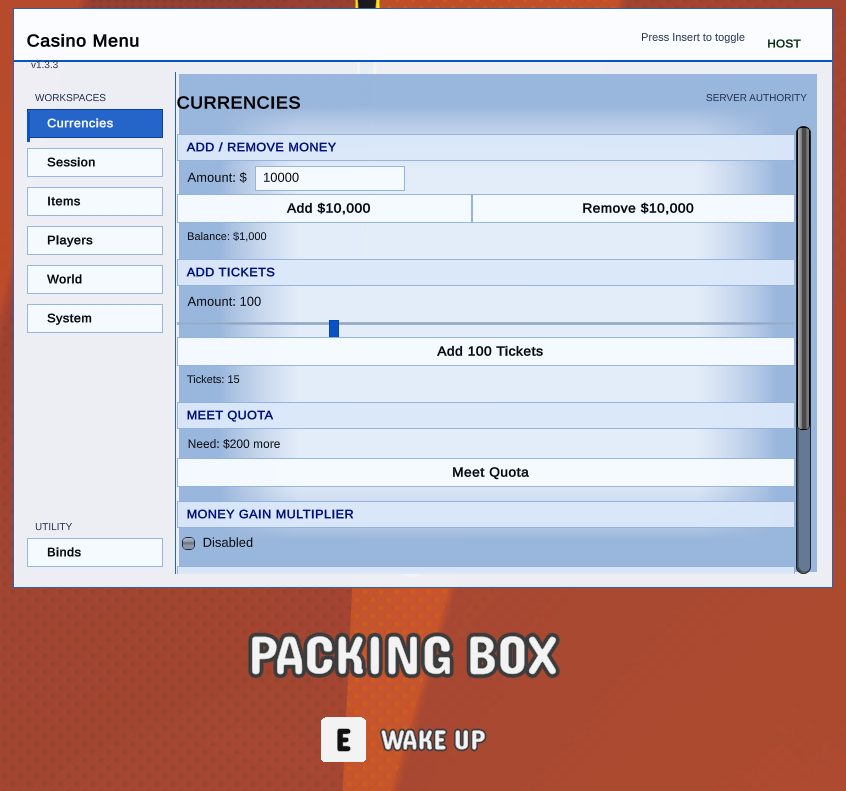

# Gamble With Your Friends Casino Menu

Casino Menu is a Linux-focused BepInEx mod menu for **Gamble With Your Friends**. It adds host-authoritative lobby controls, local client movement tools, player and NPC management, item spawning, world controls, themes, keybinds, and an optional FPS overlay.



## How It Works

The project builds one `ModMenu.dll` BepInEx plugin. BepInEx loads the plugin when the game starts, and the menu uses the game's existing Unity and Mirror APIs so synchronized actions follow the same server authority model as normal gameplay.

- Host actions use server-owned methods and replicated state
- Client actions are limited to the locally owned player
- Gameplay input is paused while the menu is open, leaving the cursor usable
- Organ edits use Steam ID-backed records and persist through the game save path
- Settings such as themes, overlays, and keybinds use Unity `PlayerPrefs`

Press `Insert` to open or close the menu. The toggle can be changed under **Binds**.

## Features

### Currencies

- Add or remove money
- Add tickets
- Meet the active quota
- Apply a money gain multiplier
- Prevent money or ticket spending
- Trigger nearby game win payouts

### Session

- Heal, wake, or reset temporary effects for every connected player
- Force organ state persistence
- Direct clients to contextual controls in the player inspector

### Items

- Discover spawnable game items at runtime
- Search the item list
- Spawn selected items through the network server
- Mark spawned items through the game's normal item persistence flow

### Players

- Inspect player name, Steam ID, connection address availability, authority, state, body, and energy
- Bring a player to the host, go to a player, move one player to another, or swap positions
- Restore or remove individual organs
- Enable per-player organ protection
- Prevent selected players from being picked up while downed
- Wake, freeze, lock head movement, rotate view, knock back, ragdoll, launch, or move a player nearby
- Drain or refill energy
- Apply temporary replicated buffs
- Assign the active NPC scope to follow any selected lobby player
- Toggle local player model visibility
- Adjust local speed, jump, and no-clip behavior

### World

- Target all NPCs, the closest NPC, or one distance-sorted NPC
- Persistently direct the selected NPC scope to follow a player
- Warp, shove, launch, ragdoll, or reset NPCs
- Change game speed
- Add, subtract, pause, or resume day time
- Set the current day and rebuild its quota cycle, floor, rewards, save state, and active casino floor
- Recover unpurchased lobby items
- Toggle an FPS overlay in the top-right corner

### System And Binds

- Choose from five complete menu themes
- Check the repository version endpoint for updates
- Disable the startup update reminder
- Rebind menu, no-clip, economy, and trigger-win actions

Host-only controls are disabled when the local player does not own server authority.

## Linux Installation

### Automated Installation

Install the required command-line tools on Arch Linux:

```bash
sudo pacman -S --needed bash coreutils curl dotnet-sdk python unzip util-linux
```

Clone the repository and run the installer:

```bash
git clone https://github.com/locainin/Gamble-With-Your-Friends-ModMenu.git
cd Gamble-With-Your-Friends-ModMenu
./install.sh
```

Select:

```text
1) Install or update Casino Menu
2) Uninstall Casino Menu and remove this installer
```

The installer:

- Finds the game through its parent directories or Steam library metadata
- Downloads the latest official `BepInEx_win_x64` release when BepInEx is missing
- Verifies the official BepInEx SHA-256 digest
- Builds the mod in Release mode
- Installs `ModMenu.dll` atomically into `BepInEx/plugins`

Direct commands are also available:

```bash
./install.sh install
./install.sh uninstall
```

The uninstall command leaves BepInEx in place because other mods may use it. It removes `ModMenu.dll` and `install.sh` itself.

### Manual Installation

Install BepInEx first if the game directory does not already contain `winhttp.dll`, `doorstop_config.ini`, and `BepInEx/core/BepInEx.dll`:

1. Download the latest `BepInEx_win_x64` archive from the [official BepInEx releases](https://github.com/BepInEx/BepInEx/releases/latest)
2. Extract the entire archive into the directory containing `Gamble With Your Friends.exe`

Clone and build the mod:

```bash
git clone https://github.com/locainin/Gamble-With-Your-Friends-ModMenu.git
cd Gamble-With-Your-Friends-ModMenu

GAME_DIR="${HOME}/.local/share/Steam/steamapps/common/Gamble With Your Friends"

dotnet restore ModMenu/ModMenu.csproj \
  -p:AuditPipeline=true \
  -p:GameInstallDir="${GAME_DIR}"

dotnet build ModMenu/ModMenu.csproj \
  --configuration Release \
  --no-restore \
  --warnaserror \
  -p:GameInstallDir="${GAME_DIR}"

install -Dm0644 \
  ModMenu/bin/Release/netstandard2.1/ModMenu.dll \
  "${GAME_DIR}/BepInEx/plugins/ModMenu.dll"
```

For a custom Steam library, set `GAME_DIR` to the directory containing the game executable.

### Steam Launch Options

Set the following in **Steam > Properties > General > Launch Options**:

```text
WINEDLLOVERRIDES="winhttp=n,b" %command%
```

Launch the game once and wait for the main menu. BepInEx logs are written to `BepInEx/LogOutput.log`.

## Windows Installation

Coming soon.
